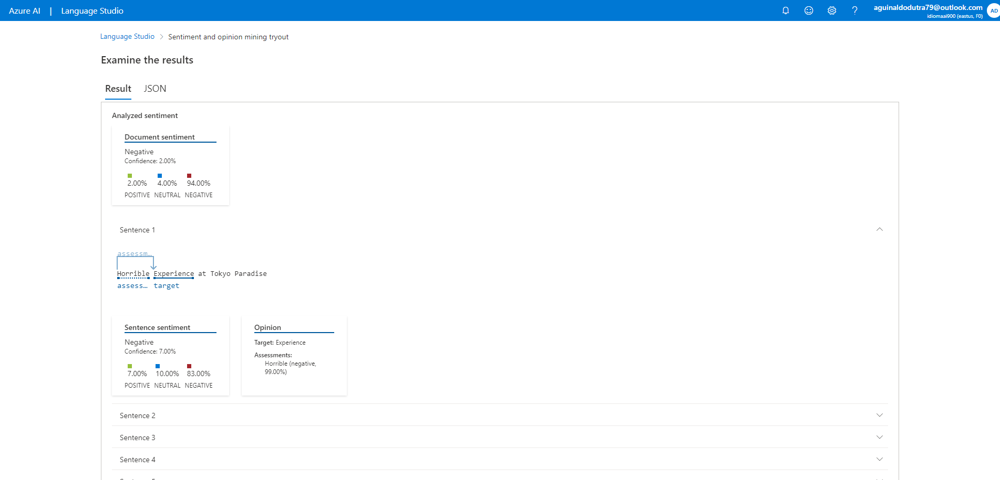
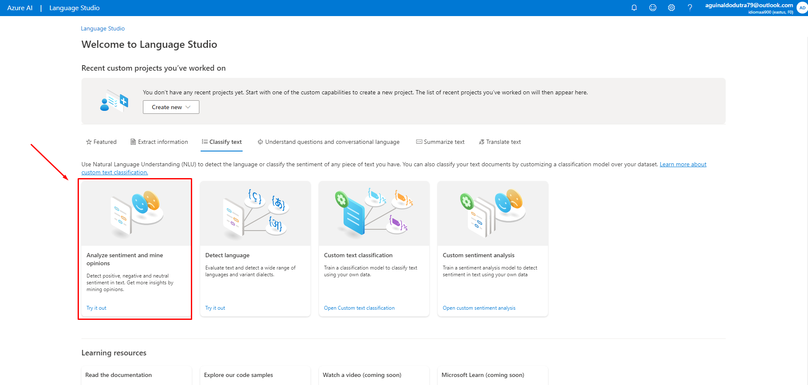
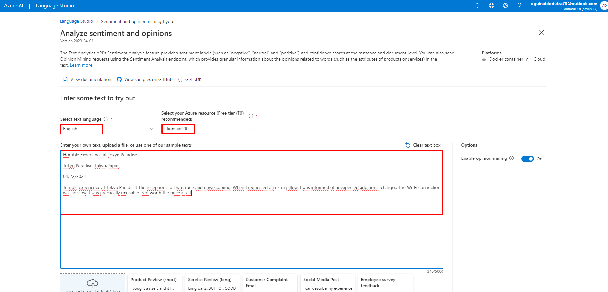
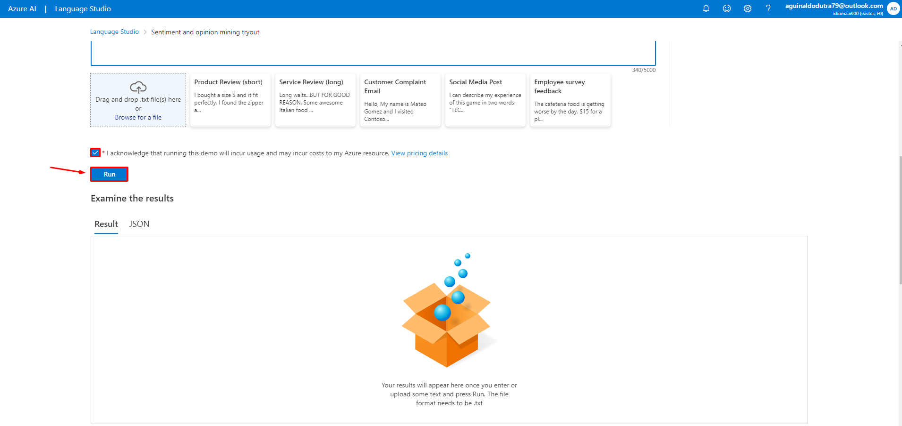
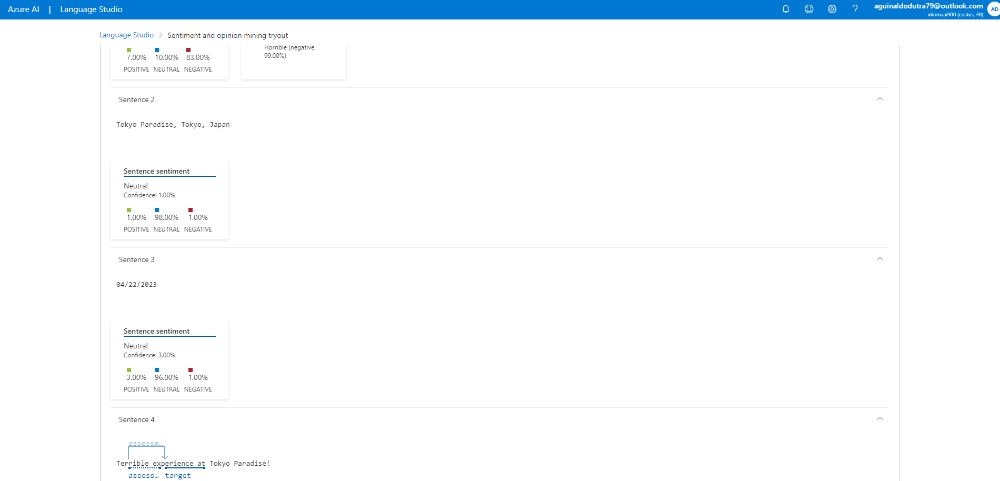
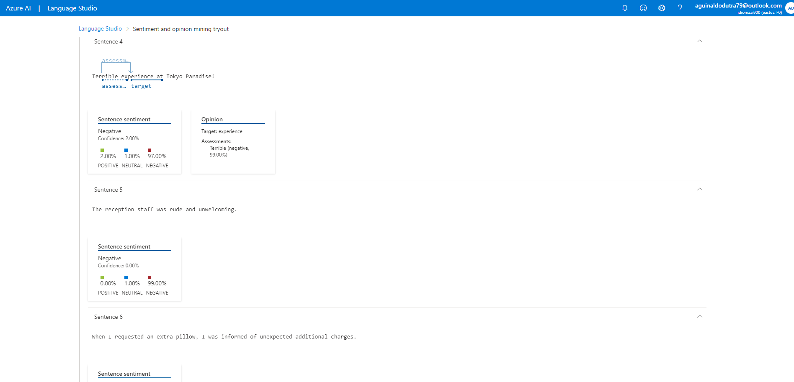
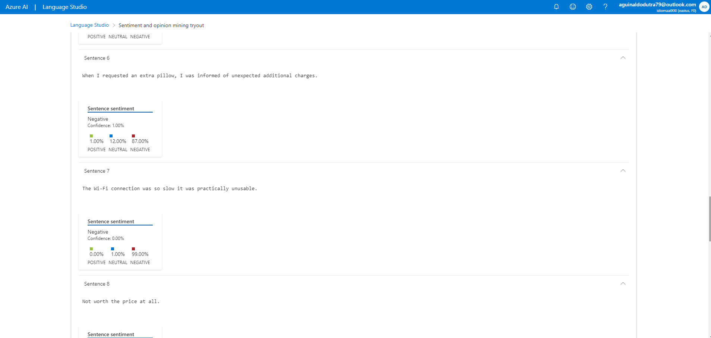
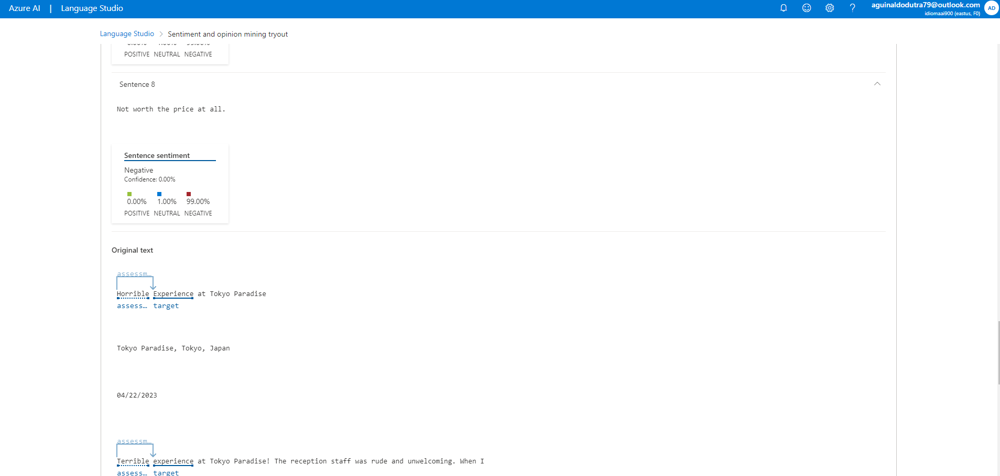
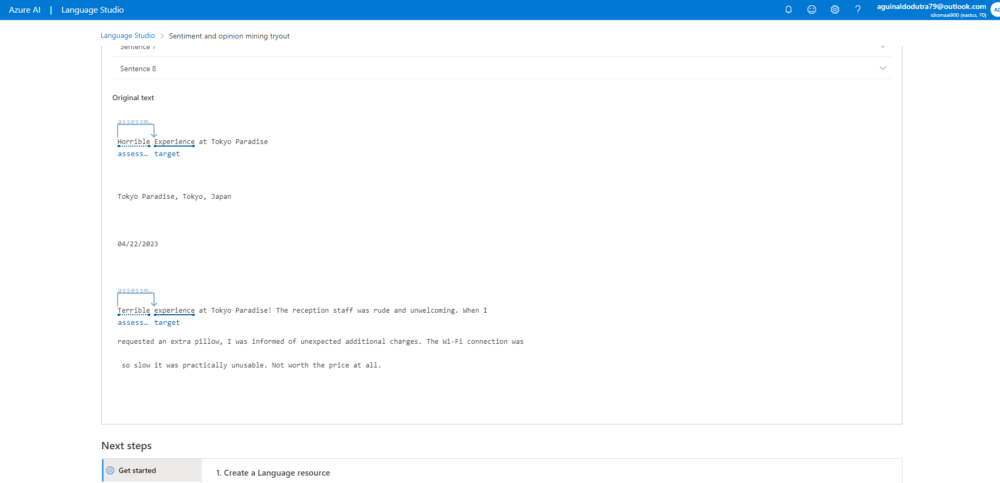

## Analyzing Sentiments in Language Studio

  

   
  

> Project developed as a challenge - AI-900 Preparation!

## About the project

Using Language Studio, I created a review of a fictional hotel in Tokyo, as if I were a guest who stayed there. Finally, the language analysis in Azure evaluates the sentences contained in my comment and displays the results in percentages, categorizing them as positive, neutral, or negative.
  
## **Analyze sentiment and mine opinions**

## Final Considerations
I was amazed when I discovered that sentiment analysis existed and was so easily accessible within Language Studio. Without a doubt, it's a powerful tool that could be utilized, for example, by a hotel chain to gather insights from customer feedback. With a deeper analysis of the data, they could then improve their services.

## 👨‍💼 Autor

<table>
  <tr>
    <td align="center">
      <a href="#">
         
        
          <b>Gian Dutra</b>
        
      </a>
    </td>
  </tr>
</table>
